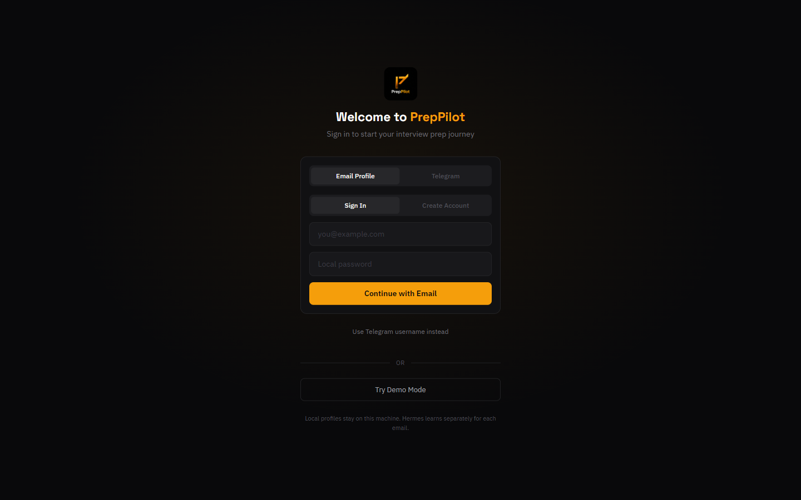
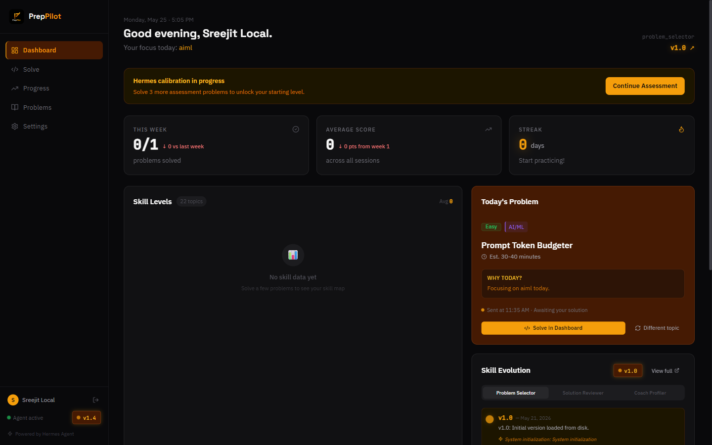
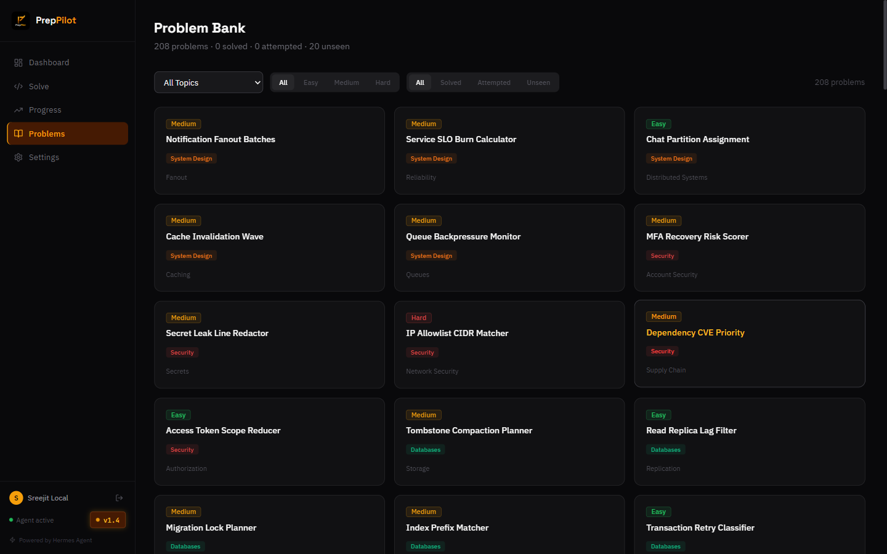
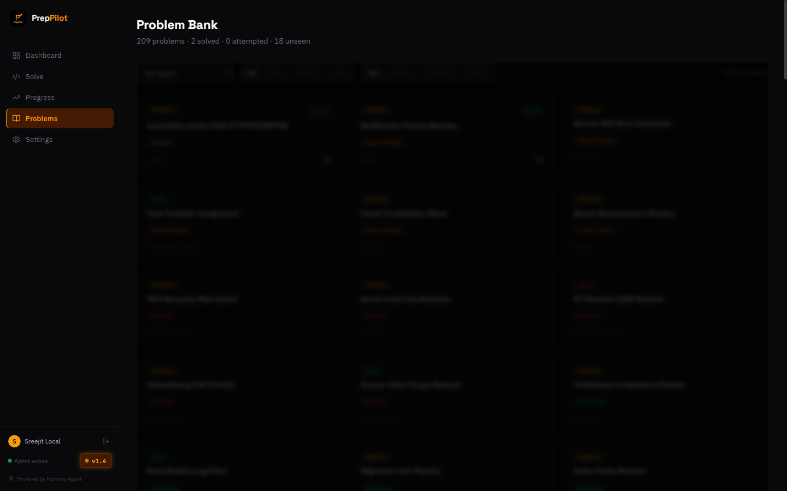
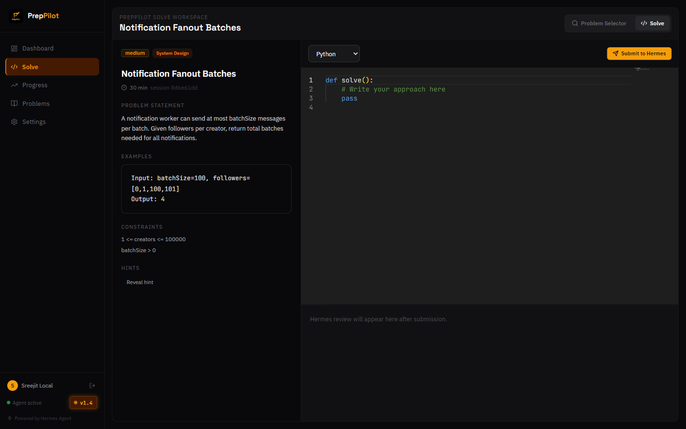
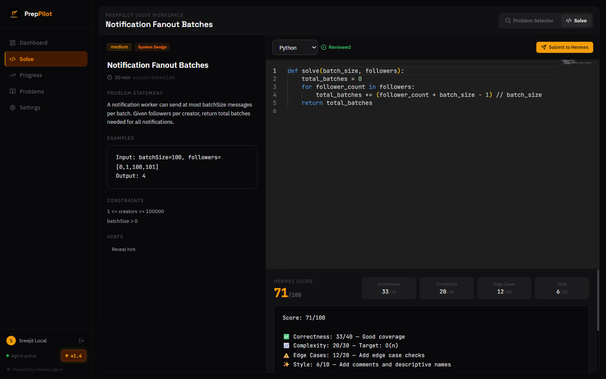
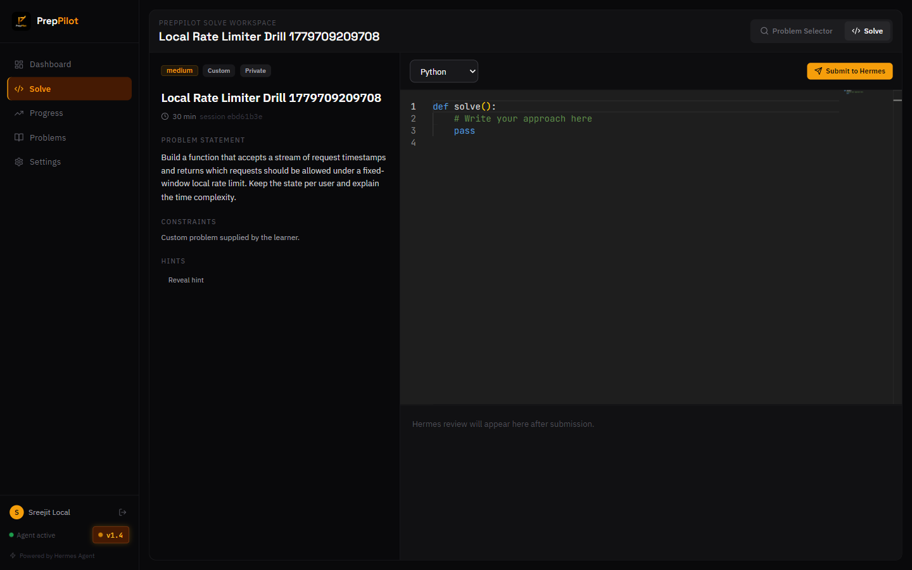
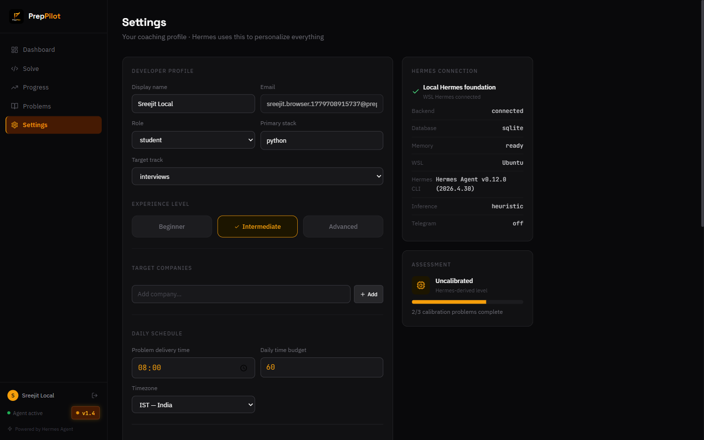

# PrepPilot

PrepPilot is a local-first Hermes-powered interview coach for the event build. It runs on your machine with Next.js, FastAPI, SQLite, local email/password profiles, a full browser solve workspace, and WSL Ubuntu Hermes verification.

The core idea is simple: every local profile gets its own coaching memory. Hermes reviews code, updates topic stats, updates the coaching profile, and lets the app recommend better work over time.

## Current Build

- **Local profiles:** email/password login is the primary path. One email creates one profile, and each profile has isolated sessions, stats, custom problems, and Hermes memory.
- **No cloud auth wall:** Google and GitHub buttons are hidden for this event build. Telegram username can remain as an optional local identity shortcut, not a live bot dependency.
- **Hermes core:** FastAPI keeps Hermes in-app through skill files, SQLite memory, session history, reviewer, selector, profiler, and skill evolution.
- **Problem bank:** 208 original shared problems plus private custom problems owned by each local profile.
- **Solve workspace:** `/solve` is a full-page split workspace with problem selector, statement, hints, Monaco editor, Hermes review, score breakdown, and helpfulness rating.
- **Local status:** Settings shows FastAPI, SQLite memory, loaded skills, heuristic/external inference mode, Telegram off, and WSL Ubuntu Hermes CLI health.

## Screenshots

The submission post references real local screenshots saved in `docs/images/`:










## How Hermes Connects

Hermes does not connect from the browser. The browser talks to the FastAPI backend, and the backend owns the Hermes foundation:

```text
Next.js UI
  -> FastAPI API
  -> canonical session submission pipeline
  -> Hermes solution_reviewer / problem_selector / coaching_profiler
  -> SQLite memory and skill versions
  -> dashboard, settings, stats, and solve workspace
```

For this local event build, the backend also checks the installed WSL Hermes CLI:

```text
runtime: wsl
distro: Ubuntu
command path: /home/sreej/.local/bin/hermes
expected version: Hermes Agent v0.12.0
```

OpenRouter or any external inference key is optional. The app still reviews with the local Hermes heuristic path when no external key is configured.

## Quick Start

### Backend

```bash
py -3.10 -m venv backend/.venv
backend/.venv/Scripts/python.exe -m pip install -r backend/requirements.txt
backend/.venv/Scripts/python.exe -m backend.seed_problems
backend/.venv/Scripts/python.exe -m uvicorn backend.main:app --host 127.0.0.1 --port 8000
```

### Frontend

```bash
cd frontend
npm install
npm run dev
```

Open:

```text
http://127.0.0.1:3000
```

Create a local profile, solve the calibration problems, then open Settings to verify the local Hermes foundation.

## Environment

Copy `.env.example` into `.env` and keep the event build local:

```env
APP_MODE=local
DATABASE_URL=sqlite:///./preppilot.db
NEXT_PUBLIC_API_URL=http://127.0.0.1:8000
NEXTAUTH_URL=http://127.0.0.1:3000
NEXTAUTH_SECRET=local-development-secret-change-me
HERMES_WSL_DISTRO=Ubuntu
HERMES_WSL_COMMAND=/home/sreej/.local/bin/hermes
OPENROUTER_API_KEY=
TELEGRAM_BOT_TOKEN=
```

## Main Flows

### Local Profile

1. Open `/login`.
2. Register with name, email, and password.
3. Sign in with the same email.
4. Duplicate registration for the same email is rejected.

### Problem Bank

1. Open `/problems`.
2. Click a problem card to view the richer problem card.
3. Click `Solve`.
4. The backend creates or reuses an active session and routes to `/solve?session_id=...`.

### Solve Workspace

1. Use the `Problem Selector` tab to search/filter the bank or create a custom private problem.
2. Use the `Solve` tab to read the statement and write code.
3. Submit to Hermes.
4. Review the score, breakdown, feedback, and rate helpfulness.

### Custom Problems

Custom problems are private by default. They use the same session and Hermes review pipeline as shared seeded problems.

### Assessment

New local profiles complete a 3-problem calibration flow. Hermes reviews each submission, updates stats and coaching memory, then assigns a starting level such as `foundation`, `interview-ready`, or `advanced`.

## API Surface

| Endpoint | Purpose |
|---|---|
| `POST /api/v1/auth/register` | Create local profile with salted PBKDF2 password hash |
| `POST /api/v1/auth/verify-password` | Verify local profile credentials |
| `GET /api/v1/hermes/status` | Show local backend, SQLite, skills, Telegram-off, and WSL Hermes health |
| `GET /api/v1/problems/?user_id=...` | List shared problems plus the user's private custom problems |
| `POST /api/v1/problems/{problem_id}/start` | Create or reuse an active solve session |
| `POST /api/v1/problems/custom` | Create a private custom problem |
| `GET /api/v1/sessions/detail/{session_id}` | Load full solve-session details |
| `POST /api/v1/sessions/{session_id}/submit` | Canonical Hermes submission endpoint |
| `PATCH /api/v1/sessions/{session_id}/feedback` | Rate feedback and trigger coaching/skill update checks |
| `GET /api/v1/dashboard/{user_id}` | Dashboard summary, assessment, today problem, stats, and skills |

## Project Structure

```text
backend/
  routers/              FastAPI route modules
  services/             Hermes submission, review, profile, demo, and stats logic
  models/               SQLAlchemy models
  seed_problems.py      Idempotent problem seeding
data/problems/
  *.json                Original shared problem banks
frontend/
  app/                  Next.js routes
  components/           Dashboard, problem, solve, and settings UI
  lib/                  API client, auth helpers, hooks
hermes/skills/
  problem_selector.md
  solution_reviewer.md
  coaching_profiler.md
docs/
  README.md
  hermes-skills.md
  images/               Local verification screenshots
```

## Verification Checklist

```bash
python -m py_compile backend/main.py backend/routers/*.py backend/services/*.py backend/models/*.py
python -m backend.seed_problems
cd frontend
npm run build
```

Browser checks:

- `/login` shows local email/password first and no Google/GitHub buttons.
- `/problems` shows 208 shared seeded problems plus any owned private problems.
- Problem card -> `Solve` opens `/solve?session_id=...`.
- Code submission returns Hermes score, breakdown, and feedback.
- Feedback rating updates the profile path.
- Custom problems are private to the creating profile.
- Settings shows the local Hermes foundation and WSL CLI status.

## Documentation

- [Docs index](docs/README.md)
- [Hermes skills deep dive](docs/hermes-skills.md)
- [Submission post](PrepPilot_SUBMISSION_POST.md)

## License

MIT
