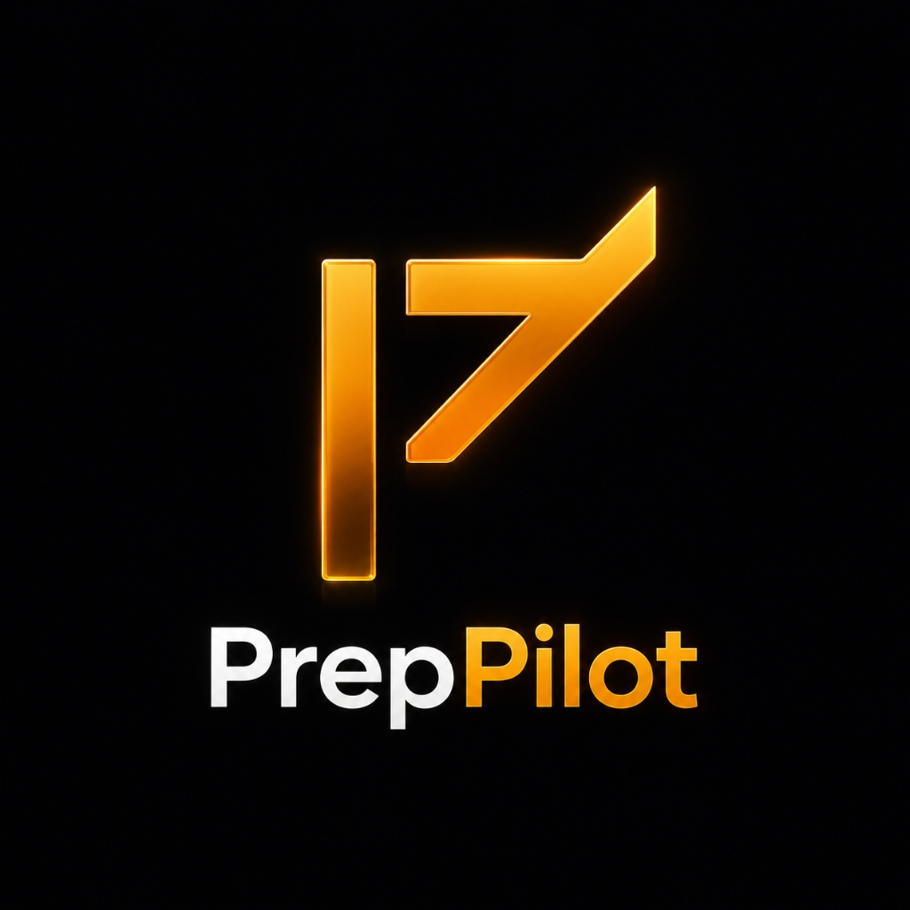
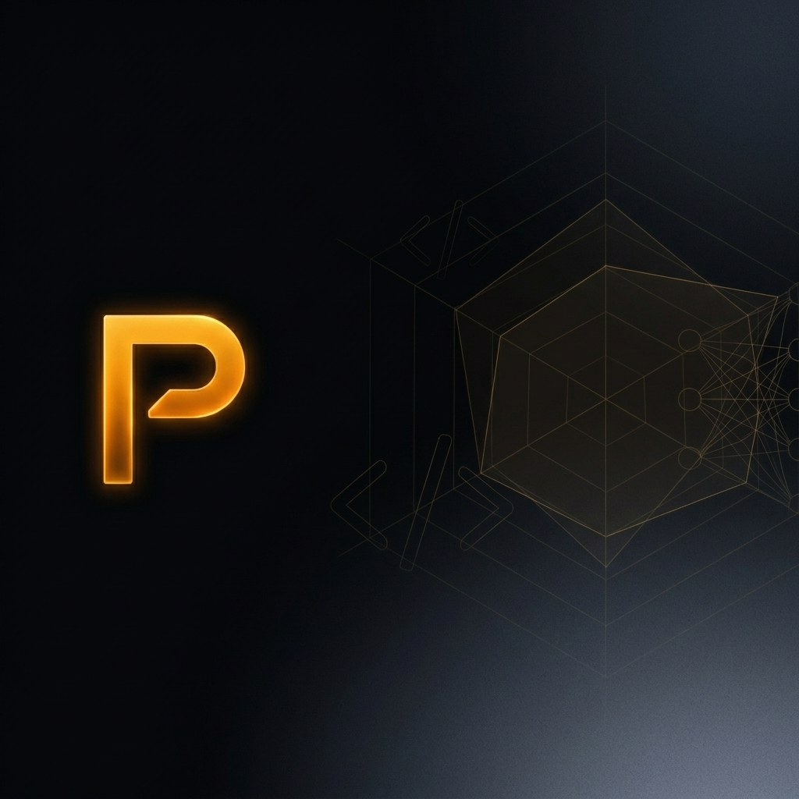
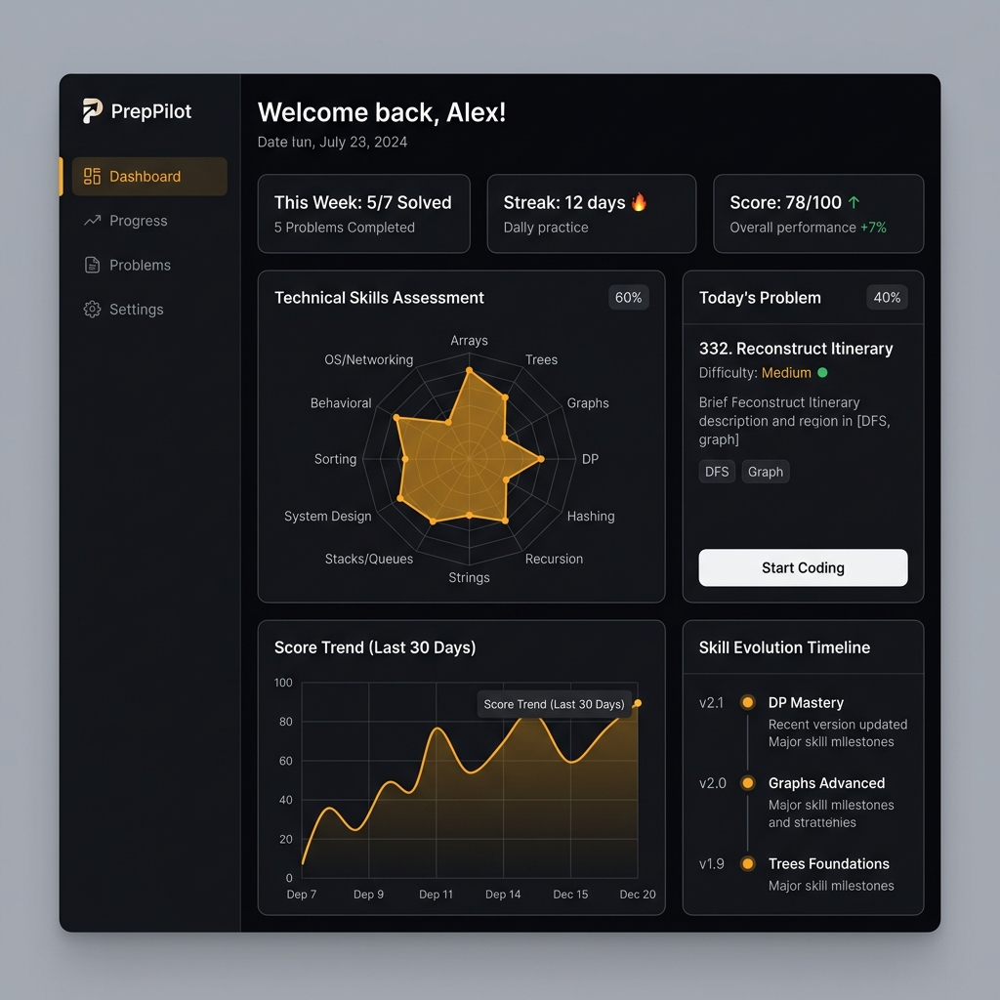
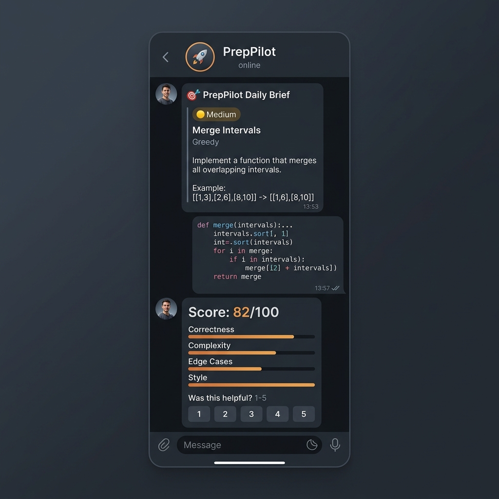
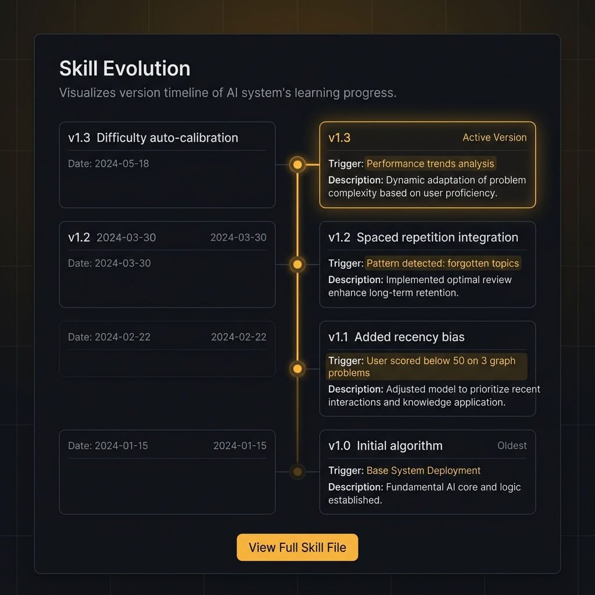
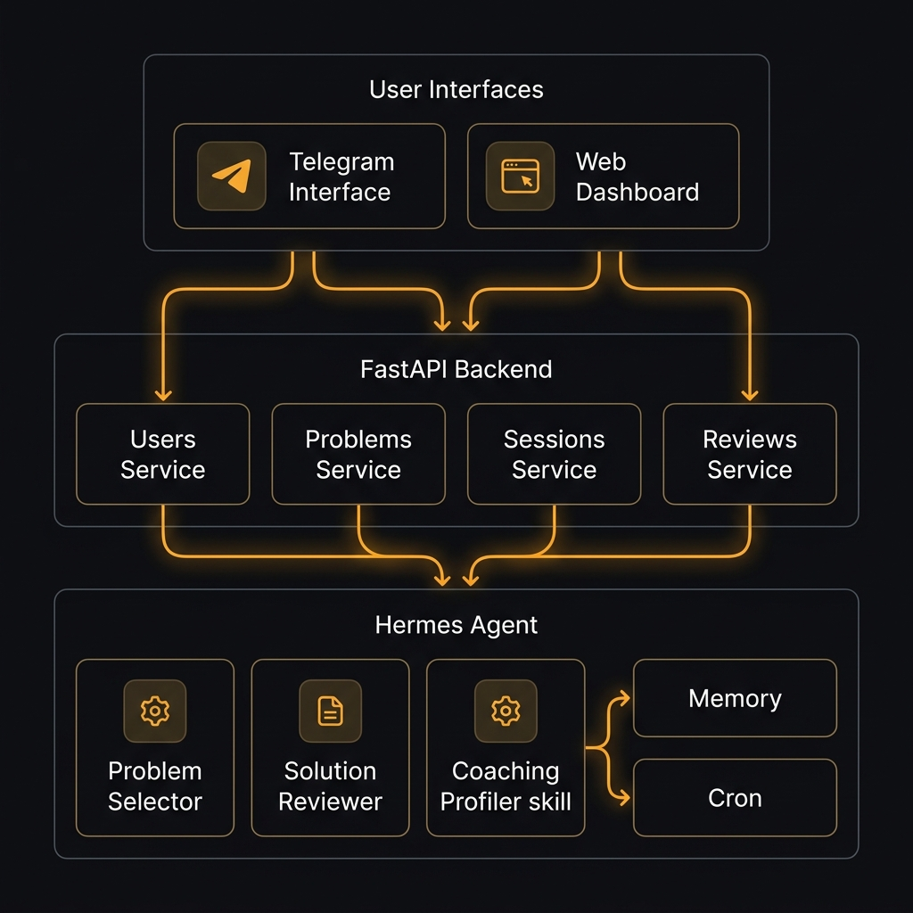
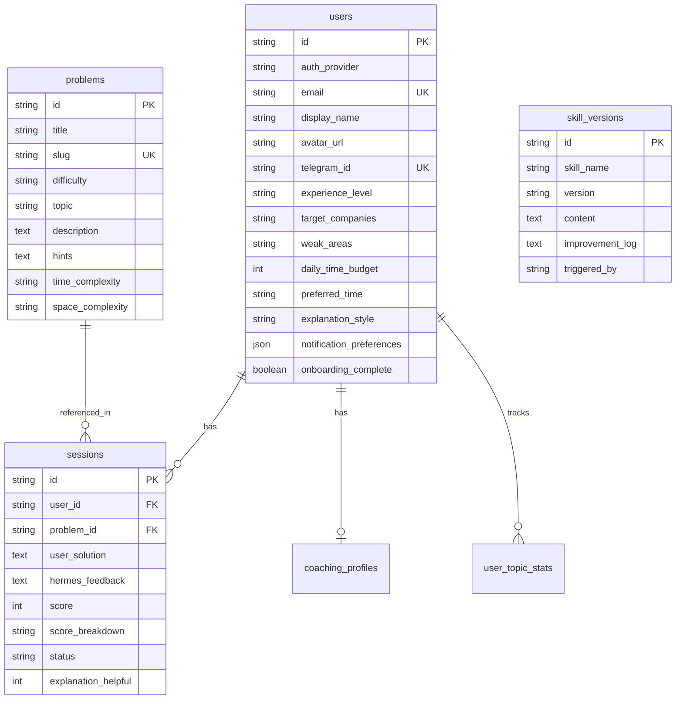

<p align="center">
  
</p>

<h1 align="center">PrepPilot</h1>
<p align="center"><strong>The interview coach that gets smarter the more you use it.</strong></p>

<p align="center">
  
</p>

<p align="center">
  <a href="#quick-start"></a>
  <a href="#tech-stack"></a>
  <a href="LICENSE"></a>
</p>

<p align="center">
  
  
  
  
  
  
  
  
</p>

---

## 🎯 What is PrepPilot?

**PrepPilot** is a self-improving technical interview coaching system powered by [Hermes Agent](https://github.com/hermes-agent). Unlike generic platforms that serve 10 million users the same problems in the same order, PrepPilot builds a **persistent, evolving model** of *your* thinking patterns, weak areas, and explanation preferences — and uses that model to deliver increasingly personalized coaching over time.

> **Every session makes the AI measurably smarter.**

The primary interface is **Telegram** — you practice where you already are. The secondary interface is a **premium web dashboard** that visualizes your growth and the AI's self-improvement in real-time.

---

## ✨ How It Works

<table>
<tr>
<td width="33%" align="center">
<h3>🎯 Personalized Daily Problems</h3>
<p>Every morning, the Hermes <code>problem_selector</code> skill analyzes your weak areas, recent performance, and spaced repetition schedule to pick the <strong>single most valuable problem</strong> for you.</p>
</td>
<td width="33%" align="center">
<h3>🧠 Adaptive AI Feedback</h3>
<p>Submit your solution via Telegram. The <code>solution_reviewer</code> evaluates correctness, complexity, edge cases, and code quality — then <strong>adapts its explanation style</strong> to how you learn best.</p>
</td>
<td width="33%" align="center">
<h3>📈 Self-Improving AI</h3>
<p>Hermes Agent's skills <strong>evolve with every session</strong>. The <code>coaching_profiler</code> tracks your thinking patterns, triggering skill improvements every 10 sessions. Visible in the dashboard.</p>
</td>
</tr>
</table>

---

## 📊 Dashboard Preview

<p align="center">
  
</p>

The dashboard features:
- **Skill Radar** — 12-axis visualization of your DSA proficiency
- **Score Trend** — 30-day performance trajectory with topic annotations
- **Skill Evolution** — Live timeline showing how the AI's coaching evolves
- **Today's Problem** — Your daily challenge with selection reasoning
- **Session History** — Every problem, score, and feedback in one view

---

## 💬 Telegram Bot Flow

<p align="center">
  
</p>

**Commands:**
| Command | Action |
|---------|--------|
| `/start` | Begin onboarding (4 quick questions) |
| `/problem` | Get today's challenge |
| `/hint` | Progressive hint (3 levels per problem) |
| `/skip` | Skip and get a new problem |
| `/stats` | Quick performance summary |
| `/dashboard` | Link to web dashboard |

**Flow:** Problem → Submit code → AI review with score → Rate helpfulness → Profile evolves

---

## 🧬 The Secret Sauce: Skill Evolution

<p align="center">
  
</p>

This is what makes PrepPilot fundamentally different from every other prep tool. **The AI is visibly learning:**

- Each Hermes skill file (`.md`) has a version, an algorithm, and an improvement log
- Every 10 sessions, the agent evaluates its own performance and rewrites its skills
- The dashboard shows the full evolution timeline: what changed, why, and when
- You can open any skill version and see the actual algorithm the AI used to coach you

---

## 🏗️ Architecture

<p align="center">
  
</p>

```
User ──→ Telegram Bot ──→ Webhooks Router ──→ Bot Service
                                                  │
                                            ┌─────┼─────┐
                                            ▼     ▼     ▼
                                        Problem  Review  Coaching
                                        Service  Service Service
                                            │     │     │
                                            └─────┼─────┘
                                                  ▼
                                          SQLite Database
                                          (6 tables)
                                                  ▲
User ──→ Next.js Dashboard ──→ API Client ──→ FastAPI ──→ Services
```

### Hermes Agent — The 6 Capabilities

| Capability | How PrepPilot Uses It |
|---|---|
| 🧠 **Persistent Memory** | Remembers every session, solution, and score across conversations |
| 📜 **Skill Files** | `problem_selector`, `solution_reviewer`, `coaching_profiler` — versioned `.md` |
| 👤 **User Modeling** | Builds coaching profile: thinking patterns, common mistakes, style preferences |
| ⏰ **Cron Jobs** | Daily problem delivery + Sunday weekly coaching reports |
| 🔗 **Cross-Session Context** | Connects patterns across weeks to identify persistent weak spots |
| 🔄 **Auto-Improvement** | Skills self-improve every 10 sessions based on accumulated data |

---

## <a id="tech-stack"></a>🛠️ Tech Stack

<table>
<tr>
<td>

### Frontend
| Technology | Purpose |
|---|---|
| Next.js 14 | App Router, SSR |
| TypeScript | Type safety |
| Vanilla CSS | Custom design tokens |
| Recharts | Radar & line charts |
| NextAuth.js | OAuth (GitHub, Google, Telegram) |
| TanStack Query | Data fetching & cache |
| Lucide React | Iconography |

</td>
<td>

### Backend
| Technology | Purpose |
|---|---|
| FastAPI | Async API framework |
| SQLAlchemy 2.0 | Async ORM |
| SQLite → PostgreSQL | Zero-cost dev DB |
| Pydantic v2 | Validation |
| APScheduler | Background jobs |
| python-telegram-bot | Bot API v21 |
| Alembic | Migrations |

</td>
</tr>
</table>

---

## <a id="quick-start"></a>🚀 Quick Start

```bash
# 1. Clone the repository
git clone https://github.com/your-username/prep-pilot.git
cd prep-pilot

# 2. Set up environment variables
cp .env.example .env
# → Edit .env:
#   - TELEGRAM_BOT_TOKEN (from @BotFather)
#   - OPENROUTER_API_KEY (from openrouter.ai)
#   - NEXTAUTH_SECRET (run: openssl rand -base64 32)
#   - GITHUB_CLIENT_ID / GITHUB_CLIENT_SECRET (optional — for GitHub login)
#   - GOOGLE_CLIENT_ID / GOOGLE_CLIENT_SECRET (optional — for Google login)

# 3. Install backend dependencies & seed the problem bank
cd backend && pip install -r requirements.txt && cd ..
python -m backend.seed_problems

# 4. Start the backend (Terminal 1)
uvicorn backend.main:app --reload --port 8000

# 5. Start the frontend (Terminal 2)
cd frontend && npm install && npm run dev
```

| Service | URL |
|---------|-----|
| 🌐 Dashboard | [localhost:3000](http://localhost:3000) |
| 📡 API Docs | [localhost:8000/docs](http://localhost:8000/docs) |
| 💚 Health Check | [localhost:8000/health](http://localhost:8000/health) |

### Docker (Alternative)

```bash
cp .env.example .env  # Edit with your keys
docker-compose up
```

---

## 📁 Project Structure

```
prep-pilot/
├── frontend/                     # 🌐 Next.js 14 Dashboard
│   ├── app/                      #    Route-based pages
│   │   ├── page.tsx              #    Landing page with hero
│   │   ├── dashboard/page.tsx    #    Main dashboard
│   │   ├── progress/page.tsx     #    Session history & filters
│   │   ├── problems/page.tsx     #    Problem browser
│   │   └── settings/page.tsx     #    User preferences
│   ├── components/
│   │   ├── dashboard/            #    SkillRadar, ScoreTrend, SkillEvolution
│   │   ├── layout/               #    Sidebar, AppShell
│   │   ├── modals/               #    SkillEvolutionModal (diff viewer)
│   │   └── ui/                   #    Card, Button, Badge, ScoreBar
│   └── lib/
│       ├── api.ts                #    Typed API client + interfaces
│       ├── hooks.ts              #    TanStack Query hooks (all data)
│       ├── auth.ts               #    NextAuth utilities (useAuth, login, logout)
│       ├── mock-data.ts          #    Topic metadata & color mappings
│       └── utils.ts              #    Helpers & styling utilities
│
├── backend/                      # 🐍 FastAPI Backend
│   ├── main.py                   #    App entry, CORS, router registration
│   ├── database.py               #    Async SQLAlchemy engine
│   ├── models/                   #    ORM: User, Problem, Session, Skill...
│   ├── schemas/                  #    Pydantic v2 request/response models
│   ├── routers/                  #    16 API endpoints across 5 routers
│   ├── services/                 #    Business logic & Telegram bot
│   ├── alembic/                  #    Database migrations
│   └── seed_problems.py          #    Populate 48 problems from JSON
│
├── hermes/                       # 🧠 Hermes Agent Layer
│   ├── config/hermes.config.yml  #    Agent configuration
│   ├── skills/                   #    Self-improving skill files (.md)
│   │   ├── problem_selector.md   #    Problem selection algorithm
│   │   ├── solution_reviewer.md  #    Code review rubric
│   │   └── coaching_profiler.md  #    User modeling logic
│   └── scripts/                  #    Cron: morning_brief, weekly_report
│
├── data/problems/                # 📦 48 seed problems (12 DSA topics)
├── docs/images/                  # 🎨 Documentation assets
├── docker-compose.yml            # 🐳 Multi-service orchestration
├── .env.example                  # 🔐 Environment variable template
└── README.md                     # 📖 This file
```

---

## 📡 API Reference

### Users — `/api/v1/users`
| Method | Endpoint | Description |
|--------|----------|-------------|
| `POST` | `/onboard` | Create user from Telegram onboarding |
| `GET` | `/{user_id}` | Get user profile |
| `PATCH` | `/{user_id}` | Update preferences |
| `GET` | `/{user_id}/stats` | Aggregated statistics |

### Problems — `/api/v1/problems`
| Method | Endpoint | Description |
|--------|----------|-------------|
| `GET` | `/` | List problems (paginated, filterable) |
| `GET` | `/{problem_id}` | Single problem detail |
| `GET` | `/today/{user_id}` | Today's selected problem |
| `POST` | `/request` | Request specific topic |

### Sessions — `/api/v1/sessions`
| Method | Endpoint | Description |
|--------|----------|-------------|
| `POST` | `/` | Create session |
| `GET` | `/{user_id}` | Session history |
| `POST` | `/{session_id}/submit` | Submit solution → AI review |
| `PATCH` | `/{session_id}/feedback` | Rate explanation (1-5) |

### Dashboard — `/api/v1/dashboard`
| Method | Endpoint | Description |
|--------|----------|-------------|
| `GET` | `/{user_id}` | All dashboard data (one call) |
| `GET` | `/{user_id}/radar` | 12-topic skill radar |
| `GET` | `/{user_id}/trend` | 30-day score trend |
| `GET` | `/{user_id}/skills` | Skill evolution history |

---

## 🗃️ Database Schema



---

## 🎨 Design System

| Token | Value | Usage |
|-------|-------|-------|
| `--background` | `#09090b` (zinc-950) | Page background |
| `--surface` | `#18181b` (zinc-900) | Card backgrounds |
| `--border` | `#3f3f46` (zinc-700) | Card borders |
| `--primary` | `#f59e0b` (amber-500) | CTAs, active states, accents |
| `--success` | `#22c55e` (green-500) | Easy difficulty, solved |
| `--warning` | `#f59e0b` (amber-500) | Medium difficulty |
| `--danger` | `#ef4444` (red-500) | Hard difficulty |
| Font (UI) | Inter | All interface text |
| Font (Code) | JetBrains Mono | Code blocks, skill files |

> **Design philosophy:** Premium, dark, developer-native — like Linear or Vercel's dashboard. No white backgrounds. Amber is the accent. Every card has subtle zinc-800 borders.

---

## 🔐 Environment Variables

### Core
| Variable | Required | Description |
|----------|----------|-------------|
| `TELEGRAM_BOT_TOKEN` | Yes | From [@BotFather](https://t.me/BotFather) |
| `OPENROUTER_API_KEY` | No* | [OpenRouter](https://openrouter.ai) for AI reviews |
| `DATABASE_URL` | No | Defaults to local SQLite |
| `BACKEND_URL` | No | Defaults to `http://localhost:8000` |
| `DASHBOARD_URL` | No | Defaults to `http://localhost:3000` |
| `NEXT_PUBLIC_API_URL` | No | Defaults to `http://localhost:8000/api/v1` |

*\*Without OpenRouter key, reviews use a heuristic scoring engine.*

### Authentication (NextAuth.js)
| Variable | Required | Description |
|----------|----------|-------------|
| `NEXTAUTH_SECRET` | Yes | Session encryption key (`openssl rand -base64 32`) |
| `NEXTAUTH_URL` | No | Defaults to `http://localhost:3000` |
| `GITHUB_CLIENT_ID` | No | GitHub OAuth app — [Create here](https://github.com/settings/developers) |
| `GITHUB_CLIENT_SECRET` | No | GitHub OAuth secret |
| `GOOGLE_CLIENT_ID` | No | Google OAuth — [Create here](https://console.cloud.google.com/apis/credentials) |
| `GOOGLE_CLIENT_SECRET` | No | Google OAuth secret |

> **Note:** Without OAuth credentials, users can still sign in via Telegram credentials or Demo mode.

---

## 📄 License

This project is licensed under the **MIT License** — see the [LICENSE](LICENSE) file for details.

---

<p align="center">
  <strong>Built with 🧠 Hermes Agent — The AI that learns how you think.</strong>
</p>
<p align="center">
  <sub>PrepPilot • Vi-Bit Technologies • 2026</sub>
</p>
